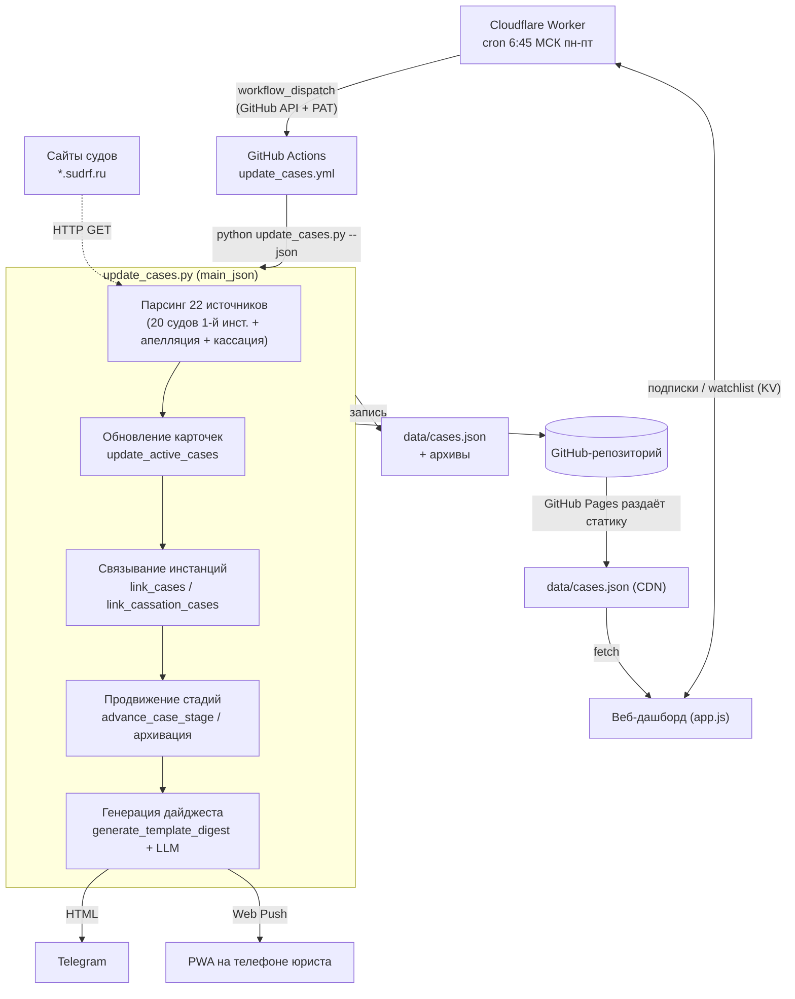

# 01. Обзор и архитектура

## Что это и зачем

Система автоматически следит за гражданскими делами с участием ПАО Сбербанк в
судах Ханты-Мансийского автономного округа — Югры и каждое утро присылает юристу
короткий **дайджест**: что нового, по каким делам прошли заседания, какие
вынесены решения и чем они грозят банку. Юристу больше не нужно вручную обходить
сайты двух десятков судов — система делает это за него и присылает выжимку в
Telegram и push-уведомлением в мобильное приложение (PWA). Полную картину по
всем делам можно посмотреть в [веб-дашборде](https://selivanovas.github.io/dashboard/sberbank_dashboard.html).

Система покрывает **три инстанции**:

- **1-я инстанция** — 20 районных и городских судов ХМАО-Югры;
- **апелляция** — Суд ХМАО-Югры;
- **кассация** — 7-й кассационный суд общей юрисдикции (фильтруем дела, пришедшие
  из судов 1-й инстанции ХМАО).

Источник данных — публичные карточки дел в ГАС «Правосудие» (поддомены
`*.sudrf.ru`). Никаких внутренних систем банка не используется.

## Из чего состоит система

| Компонент | Файл(ы) | Роль |
|-----------|---------|------|
| **Бэкенд-скрипт** | [`scripts/update_cases.py`](../../scripts/update_cases.py) | Монолит (~13 200 строк): парсеры судов, машина состояний дел, генерация дайджеста через LLM, отправка в Telegram и Web Push, CLI. Сердце системы. |
| **Данные** | [`data/cases.json`](../../data/cases.json) + архивы | Единый источник истины обо всех делах. Подробно — в [02. Модель данных](02-модель-данных.md). |
| **Фронтенд (SPA)** | [`app.js`](../../app.js), [`sberbank_dashboard.html`](../../sberbank_dashboard.html), [`styles.css`](../../styles.css) | Одностраничный дашборд без фреймворков. Читает `cases.json` напрямую с GitHub Pages. |
| **PWA** | [`manifest.json`](../../manifest.json), [`service-worker.js`](../../service-worker.js) | Превращает дашборд в устанавливаемое приложение с push-уведомлениями. |
| **Cloudflare Worker** | [`cloudflare-worker/worker.js`](../../cloudflare-worker/worker.js) | Запускает обновление по расписанию (точный cron), хранит подписки на push и watchlist (KV), отдаёт админку подписчиков. |
| **GitHub Actions** | [`.github/workflows/*.yml`](../../.github/workflows) | Среда выполнения: запускают `update_cases.py`, коммитят результат в репозиторий. |
| **GitHub Pages** | — | Хостинг дашборда и самих `data/*.json` (фронт качает их как статику). |

Ключевая особенность архитектуры: **нет отдельного сервера и базы данных**.
Состояние живёт в JSON-файлах в git-репозитории, вычисления выполняются в
эфемерных GitHub Actions, расписание держит Cloudflare Worker, статику раздаёт
GitHub Pages. Всё бесплатно и не требует обслуживания инфраструктуры.

## Поток данных

### Пошагово (ежедневный прогон)

1. **Расписание.** Cloudflare Worker по cron `45 3 * * mon-fri` (6:45 МСК, будни)
   дёргает GitHub API `workflow_dispatch` и запускает workflow `update_cases.yml`.
   Почему не cron самого GitHub Actions — он на бесплатном плане опаздывает на
   часы; Worker точен. Подробности — в [09. Cloudflare Worker](09-cloudflare-worker.md).
2. **Запуск.** GitHub Actions поднимает Python-окружение и выполняет
   `python update_cases.py --json` — это режим `main_json`
   ([`scripts/update_cases.py`](../../scripts/court_monitor/runs.py#L834)).
3. **Парсинг.** Скрипт обходит 22 источника, скачивает поисковую выдачу и
   карточки дел, разбирает HTML. См. [04. Сбор данных и парсеры](04-сбор-данных-и-парсеры.md).
4. **Обновление и связывание.** Новые события дописываются в дела, дела
   разных инстанций связываются между собой по номеру/УИД, дубликаты схлопываются.
   См. [05. Конвейер обновления](05-конвейер-обновления.md).
5. **Машина состояний.** Каждое дело продвигается по стадиям (подана жалоба →
   апелляция → кассация и т.д.), завершённые дела архивируются.
   См. [03. Жизненный цикл дела](03-жизненный-цикл-дела.md).
6. **Дайджест.** Из накопленных за прогон изменений собирается HTML-дайджест.
   Текст решений судов пересказывает LLM (по умолчанию Claude Haiku 4.5).
   См. [06. Дайджесты и LLM](06-дайджесты-и-llm.md).
7. **Доставка.** Дайджест уходит в Telegram, а персонализированные push —
   подписчикам PWA (каждому — только по его отслеживаемым делам).
   См. [07. Доставка и уведомления](07-доставка-и-уведомления.md).
8. **Коммит.** Обновлённые `data/*.json` (и legacy CSV) коммитятся в репозиторий
   автоматическим коммитом `📊 Обновление данных ...`.
9. **Просмотр.** Юрист открывает дашборд — `app.js` качает свежий `cases.json`
   прямо с GitHub Pages. См. [08. Фронтенд](08-фронтенд.md).

## Технологический стек

- **Бэкенд:** Python 3.12, только `requests` (HTTP) + стандартный
  `html.parser` для разбора HTML. Внешних парсер-библиотек нет.
- **LLM:** Anthropic Claude (модель `claude-haiku-4-5-20251001`) — основной;
  GigaChat (Сбер) — альтернативный, включается отдельным workflow.
- **Уведомления:** Telegram Bot API; Web Push (VAPID) через `pywebpush`.
- **Фронтенд:** ванильные HTML/CSS/JS, без сборки и фреймворков. Шрифты
  Literata / Source Sans 3 / JetBrains Mono. Состояние — `localStorage`.
- **Инфраструктура:** Cloudflare Workers (cron + KV-хранилище подписок),
  GitHub Actions (выполнение), GitHub Pages (хостинг).
- **Хранилище:** JSON-файлы в git. Legacy CSV (`data/sberbank_cases.csv`) всё
  ещё пишется для обратной совместимости, но источник истины — JSON.

## Ключевые проектные решения

- **Монолит вместо модулей.** Весь бэкенд в одном файле `update_cases.py`.
  Это сознательный выбор: один файл проще деплоить в GitHub Actions и держать в
  голове при отладке. Навигацию обеспечивают карта в `CLAUDE.md` и эта документация.
- **JSON в git вместо БД.** История изменений = история коммитов; откат =
  `git revert`; бэкап встроен. Цена — файл `cases.json` нельзя растить
  бесконечно, поэтому архив разделён на «горячий» и «холодный»
  (см. [02. Модель данных](02-модель-данных.md) и
  [03. Жизненный цикл](03-жизненный-цикл-дела.md)).
- **Cloudflare Worker для расписания.** Единственная причина существования
  Worker'а изначально — точный запуск. Позже он оброс хранением push-подписок и
  watchlist, потому что фронту нужен хоть какой-то серверный endpoint, а Worker
  уже был. ⚠️ Автозапуск — **только** через Worker; cron-job.org и аналоги не
  использовать.
- **Гибридный дайджест.** HTML дайджеста собирается программно
  (детерминированно, без галлюцинаций), а LLM вызывается только на узкую задачу —
  пересказать мотивировочную часть судебного акта. Это дешевле и надёжнее, чем
  отдавать всю генерацию LLM. Старый режим «весь дайджест одним LLM-вызовом»
  остался под флагом `DIGEST_FULL_LLM=1`.

## Глоссарий

| Термин | Значение |
|--------|----------|
| **Дело** | Единица мониторинга. В `cases.json` — объект с полями инстанций. Идентифицируется номером дела 1-й инстанции (или, для «найденных в кассации», — номером кассации). |
| **Инстанция** | 1-я инстанция / апелляция / кассация. У дела есть блоки `first_instance`, `appeal`, `cassation`. |
| **Стадия (`current_stage`)** | Текущее положение дела в машине состояний: `first_instance`, `awaiting_appeal`, `appeal`, `cassation_watch`, `cassation_pending`, `cassation`, `awaiting_relink`. См. [03](03-жизненный-цикл-дела.md). |
| **Карточка дела** | HTML-страница дела на сайте суда, откуда парсятся события, даты, статус, текст акта. |
| **УИД** | Уникальный идентификатор дела (напр. `86RS0020-01-2025-000203-13`) — сквозной для всех инстанций, служит мостом для связки апелляции с кассацией. |
| **Акт** | Судебный акт (решение/определение). «Акт опубликован» = на сайте выложен полный текст с мотивировкой. |
| **Дайджест** | Ежедневная HTML-сводка изменений, отправляемая в Telegram и push. |
| **Watchlist** | Список дел, на которые подписался конкретный пользователь PWA (звёздочка ★). Push приходят персонально — только по своим делам. |
| **Discovery** | Создание дела «с нуля», когда оно впервые обнаружено сразу в кассации (карточки нижестоящих инстанций у нас не было). Поле `discovered_via_cassation`. |
| **Remanded / новый круг** | Кассация отменила и направила дело на новое рассмотрение. Дело «открывается заново»: `round` инкрементируется, прошлые блоки уезжают в `history`. |
| **Горячий / холодный архив** | Горячий (`cases_archive.json`) — дела, заархивированные за последний год, грузит фронт. Холодный (`cases_archive_YYYY.json`) — старше года, фронт не грузит. |
| **PWA** | Progressive Web App — дашборд, установленный как приложение, умеет получать push. |
