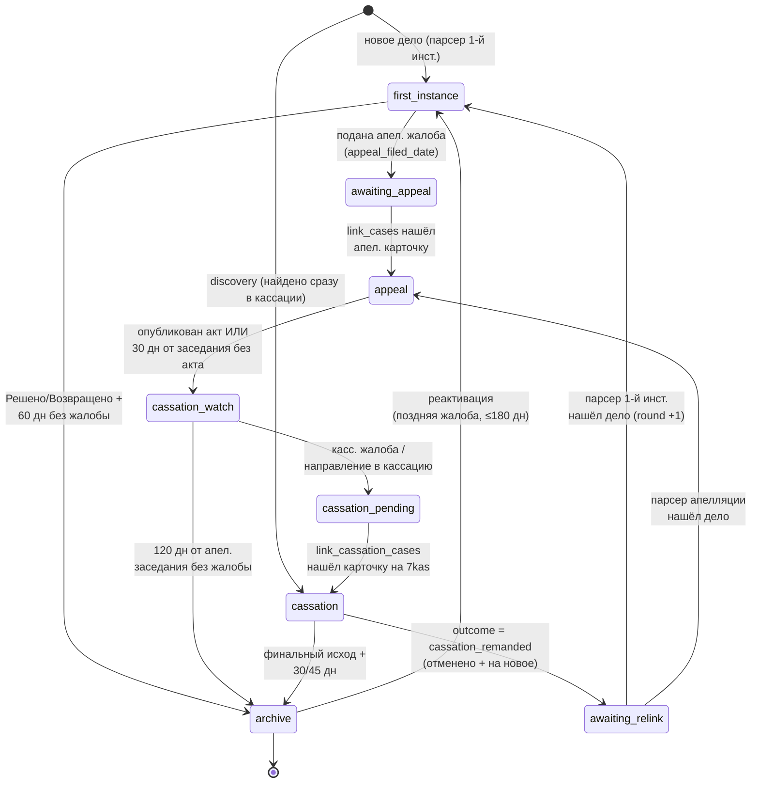

# 03. Жизненный цикл дела

## Что это и зачем

Дело не статично: оно проходит путь от поступления в суд 1-й инстанции до
кассации, а иногда возвращается на новый круг. Чтобы система знала, **какую
карточку парсить** в каждый момент и **когда дело можно убрать из активных**,
у каждого дела есть «стадия» (`current_stage`) — это конечный автомат (state
machine).

Зачем это юристу: стадия определяет, что система делает с делом прямо сейчас
(следит за 1-й инстанцией? ждёт апелляцию? проверяет кассацию?) и почему дело
в какой-то момент исчезает из дашборда (ушло в архив по тайм-ауту). Зачем
разработчику: вся логика переходов сосредоточена в трёх функциях, и менять
тайм-ауты нужно согласованно с фронтом.

## Семь стадий + архив

| Стадия | Что система парсит | Архивируется по времени? |
|--------|--------------------|--------------------------|
| `first_instance` | Карточку 1-й инстанции | Да — 60 дн без жалобы |
| `awaiting_appeal` | Ничего (жалоба подана, ждём карточку в апелляции) | Нет |
| `appeal` | Карточку апелляционного суда | Нет (только переход дальше) |
| `cassation_watch` | Карточку 1-й инст. (ищем кассационную жалобу) | Да — 120 дн без жалобы |
| `cassation_pending` | Ничего (ждём появления карточки на 7kas) | Нет |
| `cassation` | Карточку 7-го КСОЮ | Да — после публикации/вынесения акта |
| `awaiting_relink` | Ничего (ждём карточку в нижестоящей инст. после отмены) | Нет |

## Диаграмма переходов

## Три функции, управляющие циклом

Вся логика — в [`scripts/update_cases.py`](../../scripts/update_cases.py):

### `advance_case_stage(case)` — продвижение вперёд
[Строка 762](../../scripts/update_cases.py#L762). Смотрит на поля дела и при
выполнении условия меняет `current_stage`, возвращая имя прежней стадии (или
`None`). Отвечает за переходы:

- `first_instance → awaiting_appeal` — появилось `first_instance.appeal_filed_date`;
- `appeal → cassation_watch` — есть `appeal.act_date`, **или** прошло
  `APPEAL_NO_ACT_GRACE_DAYS` (30) дней от апелляционного заседания без акта;
- `cassation_watch → cassation_pending` — есть `cassation_filed_date` или
  `sent_to_cassation_date` (попутно проставляет `cassation_pending_since`);
- `cassation → awaiting_relink` — `cassation.outcome == "cassation_remanded"`.

Переходы `awaiting_appeal → appeal`, `cassation_pending → cassation` и
`awaiting_relink → first_instance/appeal` **здесь не делаются** — они зависят от
появления новой карточки и выполняются функциями связывания (см. ниже).

### `is_case_archived(case)` — пора ли в архив
[Строка 828](../../scripts/update_cases.py#L828). Унифицированная проверка по
стадии. Возвращает `true`, если дело можно архивировать:

- `first_instance`: статус `Решено`/`Возвращено` **и** прошло `FI_ARCHIVE_DAYS`
  (60) дней от `hearing_date`, **и** нет признаков поданной жалобы. Есть защита:
  если стоит флаг жалобы, но дата не извлеклась — дело держим в активных
  (см. кейс `2-208/2026` в комментарии кода);
- `cassation_watch`: прошло `CASSATION_WATCH_DAYS` (120) дней от апелляционного
  заседания без кассационной жалобы;
- `cassation`: исход финальный (не `cassation_remanded` и не `cassation_other`)
  **и** прошло `CASSATION_ACT_ARCHIVE_DAYS` (30) дней после публикации акта,
  **или** `CASSATION_NO_ACT_PUBLISH_DAYS` (45) дней от даты вынесения определения
  без публикации текста;
- `awaiting_appeal`, `appeal`, `cassation_pending`, `awaiting_relink`: **никогда**
  не архивируются по времени (ждём бессрочно).

Разделение активных и архивных по этой проверке делает `split_archived_json`
([строка 4574](../../scripts/update_cases.py#L4574)).

### `migrate_stages(cases)` — идемпотентная миграция
[Строка 893](../../scripts/update_cases.py#L893). Прогоняет `advance_case_stage`
в цикле, пока есть переходы, — подтягивает старые записи (созданные до появления
state-machine) под текущую модель. Запускается при каждом прогоне, выполнять
повторно безопасно. Заодно бэкфиллит `initial_bank_role` и чистит устаревший
`suspended_until` в кассации.

## Константы тайм-аутов

[Строки 279–305](../../scripts/update_cases.py#L279):

| Константа | Значение | Где применяется |
|-----------|----------|-----------------|
| `FI_ARCHIVE_DAYS` | 60 | 1-я инст. → архив без жалобы. Раньше 45; увеличено, т.к. мотивировка задерживается + срок на жалобу + лаг парсера. |
| `APPEAL_NO_ACT_GRACE_DAYS` | 30 | appeal → cassation_watch без опубликованного акта. |
| `CASSATION_WATCH_DAYS` | 120 | cassation_watch → архив (≈3 мес срок + почта + регистрация). |
| `CASSATION_ACT_ARCHIVE_DAYS` | 30 | cassation → архив после публикации акта. |
| `CASSATION_NO_ACT_PUBLISH_DAYS` | 45 | cassation → архив без публикации акта. |
| `COLD_ARCHIVE_DAYS` | 365 | Граница горячий/холодный архив. |

> ⚠️ **Фронт держит свою копию `ARCHIVE_DAYS`** в [`app.js`](../../app.js).
> При изменении `FI_ARCHIVE_DAYS` синхронизировать вручную, иначе дашборд начнёт
> прятать дела раньше (или позже), чем их архивирует парсер.

## Архивация, ротация и возврат

### Архивация
В конце прогона `split_archived_json` делит дела на активные и архивные по
`is_case_archived`. Архивным проставляется `archived_at`. Активные пишутся в
`cases.json`, архивные добавляются в горячий `cases_archive.json`.

### Ротация в холодный архив
`rotate_cold_archive(hot_archive)` ([строка 4620](../../scripts/update_cases.py#L4620))
выносит дела старше `COLD_ARCHIVE_DAYS` (по `archived_at`) из горячего архива в
годовые `cases_archive_YYYY.json`. Делам без штампа `archived_at` он выводится из
самой поздней даты стадий (`_infer_archived_at`) и записывается обратно
(считается один раз). Идемпотентно: дело дописывается в холодный файл, только если
его там ещё нет. Фронт холодные файлы не грузит. Подробнее — в
[02. Модель данных](02-модель-данных.md).

### Реактивация из архива
`reactivate_archived_first_instance(cases, archived_cases)`
([строка 4147](../../scripts/update_cases.py#L4147)) подмешивает обратно в активные
**недавние** (≤180 дней от `hearing_date`) дела 1-й инстанции со статусом
`Решено`, чтобы парсер перечитал карточку и поймал **поздно поданную** жалобу.
Если жалоба найдётся — `advance_case_stage` уведёт дело в `awaiting_appeal`, и оно
останется активным; если нет — `split_archived_json` вернёт его в архив тем же
прогоном. Работает только по горячему архиву (холодные дела не сканируются).
Отдельного события в дайджесте нет — срабатывает обычное «подана апел. жалоба».

### Повторный круг после отмены кассацией
Если `cassation.outcome == "cassation_remanded"`, дело переходит в
`awaiting_relink`. Когда парсер нижестоящей инстанции снова видит карточку этого
дела:

- 1-я инстанция → `relink_awaiting_relink_first_instance`
  ([строка 4096](../../scripts/update_cases.py#L4096)) вызывает
  `_snapshot_round_to_history` (прошлые блоки → `history`, `round += 1`,
  блоки инстанций обнуляются), ставит `current_stage = "first_instance"` и
  инициализирует новый блок `first_instance`;
- апелляция → дело подцепляет `link_cases`.

Связыванием инстанций (`link_cases`, `link_cassation_cases`) и порядком вызова
всех этих функций в прогоне занимается [05. Конвейер обновления](05-конвейер-обновления.md).

## Где это видно юристу

- Стадия отображается бейджем в карточке/строке дашборда (`stageBadgeHtml` в
  `app.js`).
- Уход в архив = дело пропадает из основного списка и переезжает во вкладку
  «Архив» (пока оно в горячем архиве, т.е. younger than год).
- Возврат из архива и новый круг проявляются как обычные события дайджеста.
