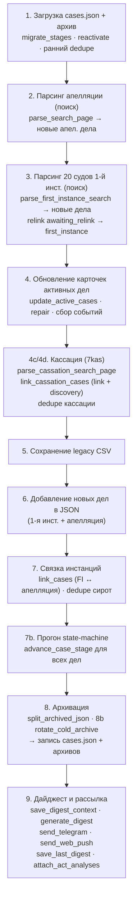

# 05. Конвейер обновления (`main_json`)

## Что это и зачем

Это «дирижёр» — функция, которая за один утренний прогон делает всё: грузит
текущие данные, обходит суды, обновляет дела, связывает инстанции, продвигает
стадии, архивирует завершённые, собирает дайджест и рассылает его. Парсеры из
[04](04-сбор-данных-и-парсеры.md) и машина состояний из [03](03-жизненный-цикл-дела.md)
— это «органы», а `main_json` — нервная система, которая включает их в строго
определённом порядке.

Порядок шагов **важен**: дедупликация должна идти после связывания, архивация —
после продвижения стадий, дайджест — в самом конце, когда все изменения уже
накоплены. Понимание этого порядка нужно, чтобы безопасно вставлять новую логику.

`main_json` — [`scripts/update_cases.py:11165`](../../scripts/update_cases.py#L11165).
Запускается как `python update_cases.py --json` (флаг `--smart-skip` включает
пропуск дел с известной будущей датой заседания).

## Карта прогона

## Шаги подробно

Номера соответствуют комментариям-баннерам в коде.

### 1. Загрузка и подготовка ([11189](../../scripts/update_cases.py#L11189))
Читаются `cases.json` и горячий архив. Затем — идемпотентная гигиена:
`migrate_stages` ([11237](../../scripts/update_cases.py#L11237)) подтягивает
старые записи под текущую модель; `reactivate_archived_first_instance`
([11245](../../scripts/update_cases.py#L11245)) подмешивает недавние архивные
дела для перепроверки поздней жалобы; ранние `dedupe_orphan_by_base_number`
([11256](../../scripts/update_cases.py#L11256)) и
`dedupe_cassation_by_internal_number` ([11267](../../scripts/update_cases.py#L11267))
чистят накопившихся двойников. Сюда же подмешиваются id холодных архивов в
индекс дедупликации (`existing_ids`), чтобы старое дело не всплыло как новое.

### 2. Парсинг апелляции ([11273](../../scripts/update_cases.py#L11273))
`parse_search_page` ([11290](../../scripts/update_cases.py#L11290)) ищет дела
Сбербанка в Суде ХМАО-Югры. Новые (которых ещё нет в базе) откладываются как
`appeal_new_cases_csv`.

### 3. Парсинг 20 судов 1-й инстанции ([11331](../../scripts/update_cases.py#L11331))
Цикл по `FIRST_INSTANCE_COURTS`: `parse_first_instance_search`
([11362](../../scripts/update_cases.py#L11362)) для каждого. Новые дела —
`fi_new_cases`. Результаты по судам копятся в `fi_results_by_court`, и сразу же
`relink_awaiting_relink_first_instance` ([11432](../../scripts/update_cases.py#L11432))
возвращает в `first_instance` дела, ждавшие нового круга после отмены кассацией.

### 4. Обновление карточек активных дел ([11442](../../scripts/update_cases.py#L11442))
`update_active_cases` ([11460](../../scripts/update_cases.py#L11460)) — обходит
карточки всех активных дел, дочитывает события, результаты, тексты актов, флаги
жалоб; формирует список `changes`. Поддерживает **smart-skip**: дело с известной
будущей датой заседания не перезапрашивается (экономия запросов).
`repair_spurious_fi_resolutions` ([11485](../../scripts/update_cases.py#L11485))
чинит ложные «дело решено», если в карточке есть будущее заседание. Дальше —
обновление полей `first_instance` ([11645](../../scripts/update_cases.py#L11645)),
**пересчёт роли банка** по участникам ([11705](../../scripts/update_cases.py#L11705)),
и сборка событий для дайджеста ([11748](../../scripts/update_cases.py#L11748)):
`fi_changes`, `stage_transitions`.

### 4c/4d. Кассация ([12308](../../scripts/update_cases.py#L12308))
`parse_cassation_search_page` ([12325](../../scripts/update_cases.py#L12325))
ищет дела на 7kas (с HMAO-фильтром). `link_cassation_cases`
([12403](../../scripts/update_cases.py#L12403)) связывает находки с делами в
базе **или создаёт новые** (discovery, если 1-инст. номера у нас не было) —
возвращает `cass_changes` и `cass_discovered`. Раздел 4d
([12420](../../scripts/update_cases.py#L12420)) делает refresh уже известных
кассационных карточек (по `cassation.link`). После обоих вызовов — резервный щит
дедупликации: `dedupe_cassation_by_internal_number`
([12529](../../scripts/update_cases.py#L12529)) и `dedupe_cassation_by_uid`
([12537](../../scripts/update_cases.py#L12537)).

### 5. Сохранение legacy CSV ([12544](../../scripts/update_cases.py#L12544))
Активные и архивные дела апелляции пишутся в CSV для обратной совместимости.

### 6. Новые дела → JSON ([12561](../../scripts/update_cases.py#L12561))
Новые дела 1-й инстанции добавляются в `cases`. Шаг 6b
([12569](../../scripts/update_cases.py#L12569)) добавляет новые апелляционные
дела в JSON — **до** связки, иначе `link_cases` их не увидит.

### 7. Связка инстанций ([12576](../../scripts/update_cases.py#L12576))
`link_cases` ([12591](../../scripts/update_cases.py#L12591)) сшивает
апелляционные дела с их записями 1-й инстанции по номеру (с учётом «гибридных»
номеров через `_bare_case_number`). После — `dedupe_orphan_by_base_number`
([12598](../../scripts/update_cases.py#L12598)) убирает оставшихся «сирот».

### 7b. Прогон машины состояний ([12620](../../scripts/update_cases.py#L12620))
`advance_case_stage` прогоняется для всех дел — переводит стадии по новым данным
(подана жалоба → `awaiting_appeal`, акт апелляции → `cassation_watch` и т.д.).

### 8. Архивация и ротация ([12644](../../scripts/update_cases.py#L12644))
`split_archived_json` ([12648](../../scripts/update_cases.py#L12648)) делит дела
на активные/архивные по `is_case_archived`. Шаг 8b `rotate_cold_archive`
([12698](../../scripts/update_cases.py#L12698)) выносит дела старше года в
холодные годовые файлы. Затем записываются `cases_archive.json`
([12709](../../scripts/update_cases.py#L12709)) и `cases.json`
([12712](../../scripts/update_cases.py#L12712)).

### 9. Дайджест и рассылка ([12715](../../scripts/update_cases.py#L12715))
Считаются счётчики активных дел по инстанциям. `save_digest_context`
([12741](../../scripts/update_cases.py#L12741)) сохраняет снимок контекста
(для `--replay-last` и фронтового `?mine=1`). `generate_digest`
([12751](../../scripts/update_cases.py#L12751)) собирает HTML.
`send_telegram` ([12764](../../scripts/update_cases.py#L12764)) и
`send_web_push` ([12794](../../scripts/update_cases.py#L12794)) рассылают.
`save_last_digest` ([12820](../../scripts/update_cases.py#L12820)) кладёт готовый
HTML для фронта. `attach_act_analyses` ([12830](../../scripts/update_cases.py#L12830))
дописывает LLM-разбор актов в дела и **повторно** сохраняет `cases.json`.
Подробно про дайджест — [06](06-дайджесты-и-llm.md), про рассылку — [07](07-доставка-и-уведомления.md).

## Из чего собирается дайджест

К шагу 9 в памяти накоплены раздельные списки событий — они и есть «вход»
дайджеста:

| Список | Откуда | Что это |
|--------|--------|---------|
| `fi_new_cases` | шаг 3 | Новые дела 1-й инстанции. |
| `appeal_new_cases_csv` | шаг 2 | Новые дела апелляции. |
| `changes` | `update_active_cases` (шаг 4) | Изменения по апелляционным делам. |
| `fi_changes` | шаг 4 | Изменения по делам 1-й инстанции. |
| `stage_transitions` | шаги 4/7b | Переходы стадий (подана жалоба, в кассацию и т.п.). |
| `cass_changes` | шаг 4c/4d | Изменения по кассации. |
| `cass_discovered` | шаг 4c | Дела, впервые найденные в кассации (discovery). |
| `total_active_*` | шаг 9 | Счётчики активных дел по инстанциям (для «Сводки»). |

> **Новые дела общесистемны.** `fi_new_cases` и `appeal_new_cases_csv` в push
> рассылаются всем подписчикам, а изменения/переходы — только по watchlist
> конкретного подписчика. См. [07. Доставка и уведомления](07-доставка-и-уведомления.md).

## Связывание инстанций — три «сшивателя»

| Функция | Строка | Связывает |
|---------|--------|-----------|
| `link_cases` | [3936](../../scripts/update_cases.py#L3936) | 1-я инстанция ↔ апелляция (по номеру дела 1-й инст. из апел. карточки). |
| `link_cassation_cases` | [4293](../../scripts/update_cases.py#L4293) | существующие дела ↔ кассация на 7kas; **создаёт discovery-дела**, если 1-инст. номера не было. Индексирует по fi-номеру, по `cassation.case_number` (`8Г-…`) и по УИД. |
| `relink_awaiting_relink_first_instance` | [4096](../../scripts/update_cases.py#L4096) | `awaiting_relink` → `first_instance` после отмены кассацией (новый круг). |

## Семейство `dedupe_*`

Идемпотентные «щиты» против двойников, накапливающихся из-за рассинхрона номеров
дел между инстанциями и discovery:

| Функция | Строка | Схлопывает |
|---------|--------|-----------|
| `dedupe_orphan_by_base_number` | [938](../../scripts/update_cases.py#L938) | «сироту»-апелляцию (stub-FI) в реального хозяина по базовому номеру. |
| `dedupe_cassation_by_internal_number` | [1035](../../scripts/update_cases.py#L1035) | записи с одинаковым `cassation.case_number` (`8Г-…`). |
| `dedupe_cassation_by_uid` | [1165](../../scripts/update_cases.py#L1165) | discovery-двойник в реальную запись по совпадению УИД. |

Все они вызываются дважды (рано — для чистки наследия, поздно — как щит после
связывания), потому что идемпотентны и дёшевы.
