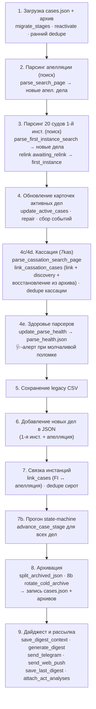

# 05. Конвейер обновления (`main_json`)

## Что это и зачем

Это «дирижёр» — функция, которая за один утренний прогон делает всё: грузит
текущие данные, обходит суды, обновляет дела, связывает инстанции, продвигает
стадии, архивирует завершённые, собирает дайджест и рассылает его. Парсеры из
[04](04-сбор-данных-и-парсеры.md) и машина состояний из [03](03-жизненный-цикл-дела.md)
— это «органы», а `main_json` — нервная система, которая включает их в строго
определённом порядке.

Порядок шагов **важен**: дедупликация должна идти после связывания, архивация —
после продвижения стадий, дайджест — в самом конце, когда все изменения уже
накоплены. Понимание этого порядка нужно, чтобы безопасно вставлять новую логику.

`main_json` — [`scripts/update_cases.py:11524`](../../scripts/update_cases.py#L11524).
Запускается как `python update_cases.py --json` (флаг `--smart-skip` включает
пропуск дел с известной будущей датой заседания).

## Карта прогона

## Шаги подробно

Номера соответствуют комментариям-баннерам в коде.

### 1. Загрузка и подготовка ([11548](../../scripts/update_cases.py#L11548))
Читаются `cases.json` и горячий архив. Затем — идемпотентная гигиена:
`migrate_stages` ([11596](../../scripts/update_cases.py#L11596)) подтягивает
старые записи под текущую модель; `reactivate_archived_first_instance`
([11604](../../scripts/update_cases.py#L11604)) подмешивает недавние архивные
дела для перепроверки поздней жалобы; ранние `dedupe_orphan_by_base_number`
([11615](../../scripts/update_cases.py#L11615)) и
`dedupe_cassation_by_internal_number` чистят накопившихся двойников. Сюда же
подмешиваются id холодных архивов в индекс дедупликации (`existing_ids`),
чтобы старое дело не всплыло как новое.

### 2. Парсинг апелляции ([11632](../../scripts/update_cases.py#L11632))
`parse_search_page` ([11657](../../scripts/update_cases.py#L11657)) ищет дела
Сбербанка в Суде ХМАО-Югры. Новые (которых ещё нет в базе) откладываются как
`appeal_new_cases_csv`. Количество строк выдачи уходит в наблюдения детектора
здоровья (шаг 4e).

### 3. Парсинг 20 судов 1-й инстанции ([11699](../../scripts/update_cases.py#L11699))
Цикл по `FIRST_INSTANCE_COURTS`: `parse_first_instance_search`
([11732](../../scripts/update_cases.py#L11732)) для каждого; количество
результатов (или факт «страница не загрузилась») копится для детектора
здоровья. Новые дела — `fi_new_cases`. Результаты по судам собираются в
`fi_results_by_court`, и сразу же `relink_awaiting_relink_first_instance`
([11803](../../scripts/update_cases.py#L11803)) возвращает в `first_instance`
дела, ждавшие нового круга после отмены кассацией (номера матчятся с
нормализацией `_bare_case_number` — «гибридный» id находит короткую форму).

### 4. Обновление карточек активных дел ([11813](../../scripts/update_cases.py#L11813))
`update_active_cases` ([11831](../../scripts/update_cases.py#L11831)) — обходит
карточки всех активных дел, дочитывает события, результаты, тексты актов, флаги
жалоб; формирует список `changes`. Поддерживает **smart-skip**: дело с известной
будущей датой заседания не перезапрашивается (экономия запросов).
`repair_spurious_fi_resolutions` ([11856](../../scripts/update_cases.py#L11856))
чинит ложные «дело решено», если в карточке есть будущее заседание. Дальше —
обновление полей `first_instance` ([12016](../../scripts/update_cases.py#L12016)),
**пересчёт роли банка** по участникам ([12076](../../scripts/update_cases.py#L12076)),
и сборка событий для дайджеста ([12119](../../scripts/update_cases.py#L12119)):
`fi_changes`, `stage_transitions`.

### 4c/4d. Кассация ([12679](../../scripts/update_cases.py#L12679))
`parse_cassation_search_page` ([12701](../../scripts/update_cases.py#L12701))
ищет дела на 7kas (с HMAO-фильтром; в детектор здоровья уходят **два** счётчика —
вся выдача и после HMAO-фильтра, второй ловит слетевший матчер судов, класс
бага «Берёзовский» ё/е). `link_cassation_cases`
([12787](../../scripts/update_cases.py#L12787)) связывает находки с делами в
базе, **создаёт новые** (discovery, если 1-инст. номера у нас не было) или
**восстанавливает дело из горячего архива** (архив передаётся параметром;
восстановление вместо discovery-дубля, штамп `archived_at` снимается). Здесь же:

- защита от «воскрешения» прошлого круга — карточки, чей `8Г`-номер уже лежит
  в `history` дела, пропускаются (см. [03](03-жизненный-цикл-дела.md));
- дедуп определений через `data/.cassation_acts` — повторный `new_act` по уже
  обработанному определению («мигание» `act_published` из-за сбойного парса)
  в дайджест не уходит.

Раздел 4d ([12805](../../scripts/update_cases.py#L12805)) делает refresh уже
известных кассационных карточек (по `cassation.link`). После обоих вызовов —
резервный щит дедупликации: `dedupe_cassation_by_internal_number` и
`dedupe_cassation_by_uid`.

### 4e. Здоровье парсеров ([12929](../../scripts/update_cases.py#L12929))
`update_parse_health` сравнивает наблюдения прогона (сколько строк дал поиск
каждого источника; `None` — страница не загрузилась) с историей в
`data/parse_health.json` и собирает алерты: источник с медианой ≥1 вернул 0
(на 1-м и 3-м нулевом прогоне + сообщение о восстановлении), HTTP-фейл 3 прогона
подряд, все источники разом по нулям, ≥5 карточек-«огрызков» за прогон
(счётчик `METRICS["cards_degraded"]`). Алерты уходят сервисным 🩺-сообщением в
Telegram. Детектор обёрнут в try/except и не может уронить прогон. Смысл:
смена вёрстки суда без детектора неотличима от «сегодня нет новостей».

### 5. Сохранение legacy CSV ([12955](../../scripts/update_cases.py#L12955))
Активные и архивные дела апелляции пишутся в CSV для обратной совместимости.

### 6. Новые дела → JSON ([12972](../../scripts/update_cases.py#L12972))
Новые дела 1-й инстанции добавляются в `cases`. Шаг 6b
([12980](../../scripts/update_cases.py#L12980)) добавляет новые апелляционные
дела в JSON — **до** связки, иначе `link_cases` их не увидит.

### 7. Связка инстанций ([12987](../../scripts/update_cases.py#L12987))
`link_cases` ([13002](../../scripts/update_cases.py#L13002)) сшивает
апелляционные дела с их записями 1-й инстанции по номеру (с учётом «гибридных»
номеров через `_bare_case_number`). Содержательная апелляция защищена от
перезаписи: если у дела уже есть апел. блок с данными (акт/события/результат),
а пришла карточка с **другим** апел. номером (обычно частная жалоба на
определение) — слияние пропускается, вторая карточка остаётся отдельной
записью. После — `dedupe_orphan_by_base_number`
([13009](../../scripts/update_cases.py#L13009)) убирает оставшихся «сирот».

### 7b. Прогон машины состояний ([13031](../../scripts/update_cases.py#L13031))
`advance_case_stage` прогоняется для всех дел — переводит стадии по новым данным
(подана жалоба → `awaiting_appeal`, акт апелляции → `cassation_watch` и т.д.).

### 8. Архивация и ротация ([13055](../../scripts/update_cases.py#L13055))
`split_archived_json` ([13059](../../scripts/update_cases.py#L13059)) делит дела
на активные/архивные по `is_case_archived`. Шаг 8b `rotate_cold_archive`
([13109](../../scripts/update_cases.py#L13109)) выносит дела старше года в
холодные годовые файлы. Архивный файл пересохраняется и при «чистом»
восстановлении дел кассацией (см. 4c). Затем записываются `cases_archive.json`
и `cases.json`.

### 9. Дайджест и рассылка ([13126](../../scripts/update_cases.py#L13126))
Считаются счётчики активных дел по инстанциям. `save_digest_context`
([13152](../../scripts/update_cases.py#L13152)) сохраняет снимок контекста
(для `--replay-last` и фронтового `?mine=1`). `generate_digest`
([13162](../../scripts/update_cases.py#L13162)) собирает HTML.
`send_telegram` ([13175](../../scripts/update_cases.py#L13175)) и
`send_web_push` рассылают. `save_last_digest` кладёт готовый HTML для фронта.
`attach_act_analyses` дописывает LLM-разбор актов в дела и **повторно**
сохраняет `cases.json`.
Подробно про дайджест — [06](06-дайджесты-и-llm.md), про рассылку — [07](07-доставка-и-уведомления.md).

## Из чего собирается дайджест

К шагу 9 в памяти накоплены раздельные списки событий — они и есть «вход»
дайджеста:

| Список | Откуда | Что это |
|--------|--------|---------|
| `fi_new_cases` | шаг 3 | Новые дела 1-й инстанции. |
| `appeal_new_cases_csv` | шаг 2 | Новые дела апелляции. |
| `changes` | `update_active_cases` (шаг 4) | Изменения по апелляционным делам. |
| `fi_changes` | шаг 4 | Изменения по делам 1-й инстанции. |
| `stage_transitions` | шаги 4/7b | Переходы стадий (подана жалоба, в кассацию и т.п.). |
| `cass_changes` | шаг 4c/4d | Изменения по кассации. |
| `cass_discovered` | шаг 4c | Дела, впервые найденные в кассации (discovery). |
| `total_active_*` | шаг 9 | Счётчики активных дел по инстанциям (для «Сводки»). |

> **Новые дела общесистемны.** `fi_new_cases` и `appeal_new_cases_csv` в push
> рассылаются всем подписчикам, а изменения/переходы — только по watchlist
> конкретного подписчика. См. [07. Доставка и уведомления](07-доставка-и-уведомления.md).

## Связывание инстанций — три «сшивателя»

| Функция | Строка | Связывает |
|---------|--------|-----------|
| `link_cases` | [4110](../../scripts/update_cases.py#L4110) | 1-я инстанция ↔ апелляция (по номеру дела 1-й инст. из апел. карточки). Не затирает содержательную апелляцию второй карточкой с другим номером (частная жалоба). |
| `link_cassation_cases` | [4505](../../scripts/update_cases.py#L4505) | существующие дела ↔ кассация на 7kas; **создаёт discovery-дела** или **восстанавливает из горячего архива**. Индексирует по fi-номеру, по `cassation.case_number` (`8Г-…`) и по УИД; guard прошлого круга по `history`; дедуп определений `.cassation_acts`. |
| `relink_awaiting_relink_first_instance` | [4291](../../scripts/update_cases.py#L4291) | `awaiting_relink` → `first_instance` после отмены кассацией (новый круг). Матч с нормализацией `_bare_case_number` с обеих сторон. |

## Семейство `dedupe_*`

Идемпотентные «щиты» против двойников, накапливающихся из-за рассинхрона номеров
дел между инстанциями и discovery:

| Функция | Строка | Схлопывает |
|---------|--------|-----------|
| `dedupe_orphan_by_base_number` | [1111](../../scripts/update_cases.py#L1111) | «сироту»-апелляцию (stub-FI) в реального хозяина по базовому номеру. |
| `dedupe_cassation_by_internal_number` | [1208](../../scripts/update_cases.py#L1208) | записи с одинаковым `cassation.case_number` (`8Г-…`). |
| `dedupe_cassation_by_uid` | [1338](../../scripts/update_cases.py#L1338) | discovery-двойник в реальную запись по совпадению УИД. |

Все они вызываются дважды (рано — для чистки наследия, поздно — как щит после
связывания), потому что идемпотентны и дёшевы.
